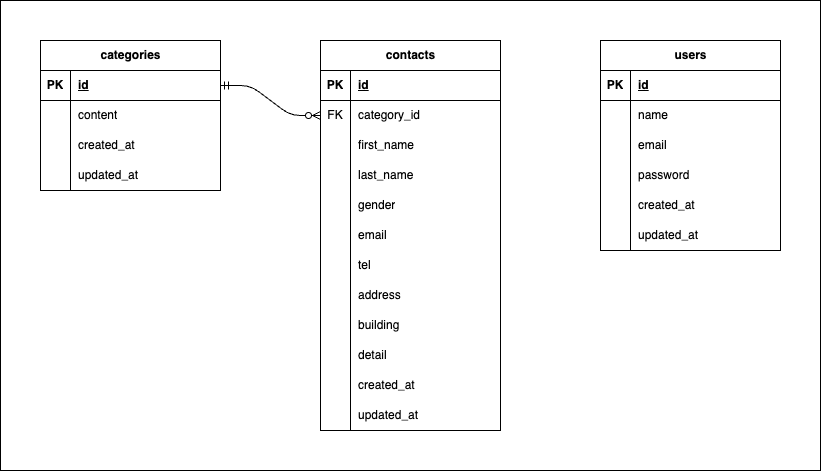

# アプリケーション名
contact-form_test

## 環境構築
1. docker-compose.yml を作成。
2. nginx用に default.conf を作成。
3. mysql用に my.conf を作成。
4. php用に Dockerfile と php.iniを作成。
5. docker-compose up -d --build コマンドで開発環境をビルド。
6. docker-compose exec php bash でphpコンテナにアクセス。
7. composer create-project "laravel/laravel=8.*" . --prefer-dist でlaravelプロジェクトを作成。
8. config/app.php のtimezoneを 'Asia/Tokyo' に変更。
9. cp .env.example .env で環境変数をdocker-compose.ymlの記述に合うように編集。
10. php artisan key:generate コマンドでアプリケーションのキーを生成。
11. php artisan make:migration create_contacts_table コマンドで contactsテーブル用のマイグレーションファイルを作成。
12. php artisan make:migration create_categories_table コマンドで categoriesテーブル用のマイグレーションファイルを作成。
13. categoriesテーブル(主テーブル)がcontactsテーブル(従テーブル)よりも先にマイグレーションが実行される様に、マイグレーションファイル名を調整。
14. php artisan migrate コマンドでマイグレーションを実行する。

## 使用技術(実行環境)
- nginx 1.21.1
- php 8.1.33
- MySQL 8.0.26
- phpmyadmin 5.2.3
- laravel 8.83.29

## ER図

## URL
- 開発環境：http://localhost